### Architecture diagrams

Companion to [requirements.md](requirements.md) and
[plugin-api.md](plugin-api.md). Diagrams are Mermaid, so they render inline on
GitHub and GitLab and stay diffable in review.

Phase tags follow the requirements: **`[PoC]`**, `[P2]`, `[L]`.

---

#### 1. System overview

Everything below the dashed line is the application. Plugins sit outside it and
are reached only through the ABI.

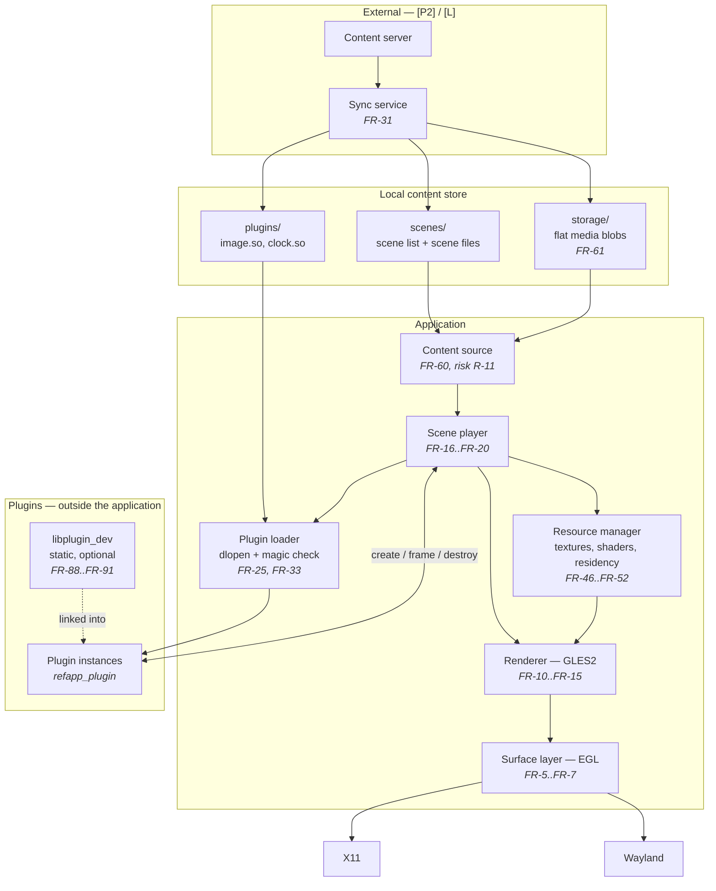

Rendered: [01-system-overview.svg](diagrams/01-system-overview.svg)

---

#### 2. Platform layering

One GL path serves both display servers; EGL is the seam that makes that true
and keeps a WebGL target reachable.

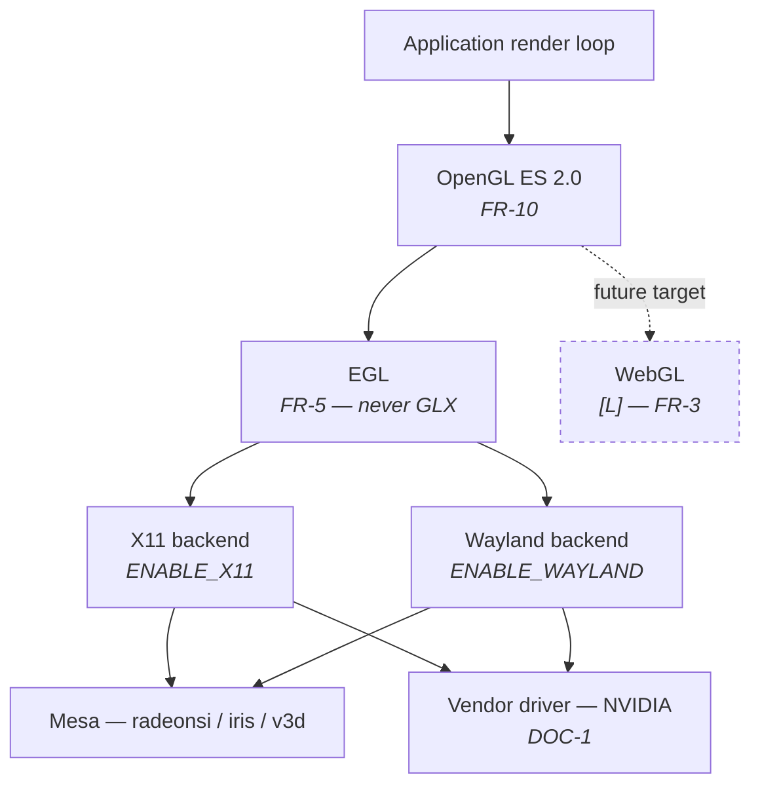

Rendered: [02-platform-layering.svg](diagrams/02-platform-layering.svg)

---

#### 3. Runtime data model

Ownership, not classes. Matches §7 of the requirements.

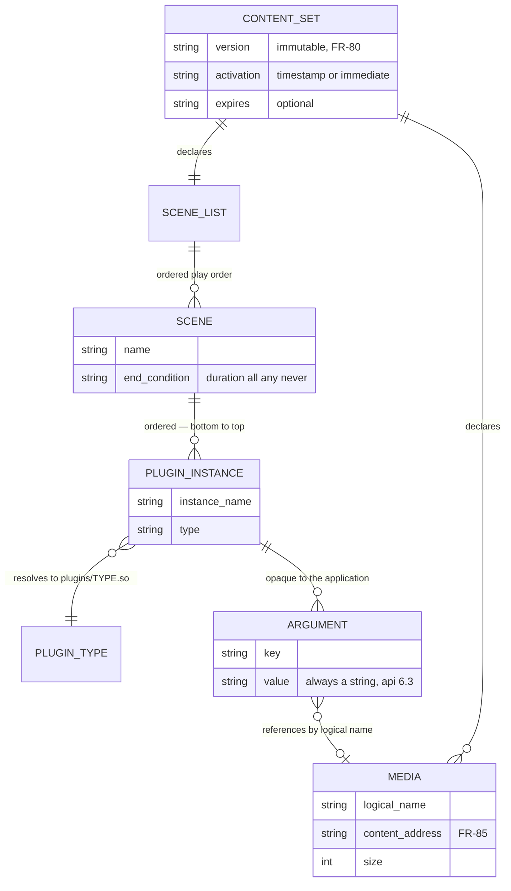

Rendered: [03-runtime-data-model.svg](diagrams/03-runtime-data-model.svg)

---

#### 4. Plugin layering

Why the C shim exists twice over: it is the ABI boundary, and it is where
pixel loops must live whatever the plugin's logic is written in.

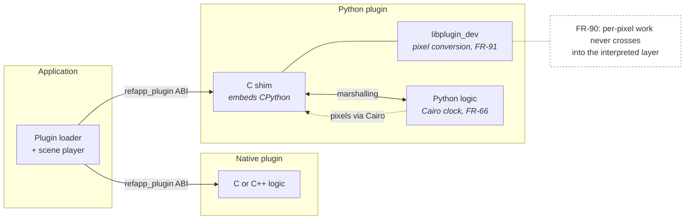

Rendered: [04-plugin-layering.svg](diagrams/04-plugin-layering.svg)

---

#### 5. Sequence — scene start

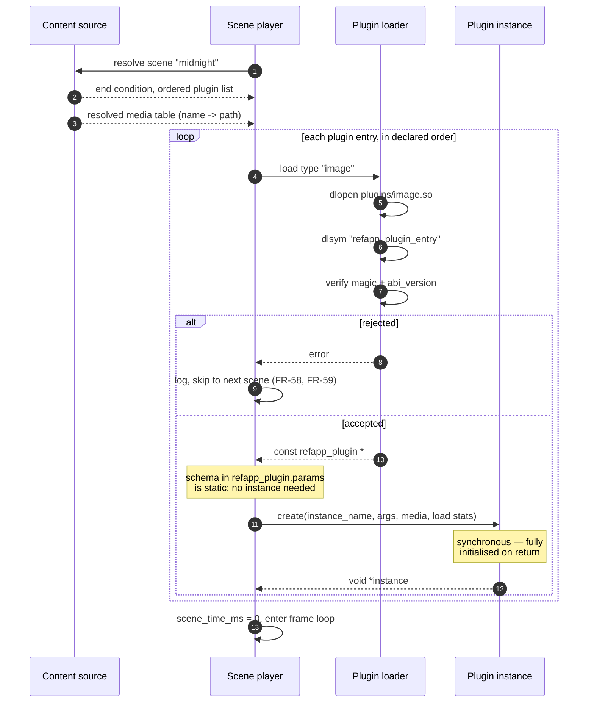

Rendered: [05-sequence-scene-start.svg](diagrams/05-sequence-scene-start.svg)

---

#### 6. Sequence — one frame

The hot path. Note that nothing here allocates: plugins serve from buffers
owned since `create`, and the application copies what it keeps.

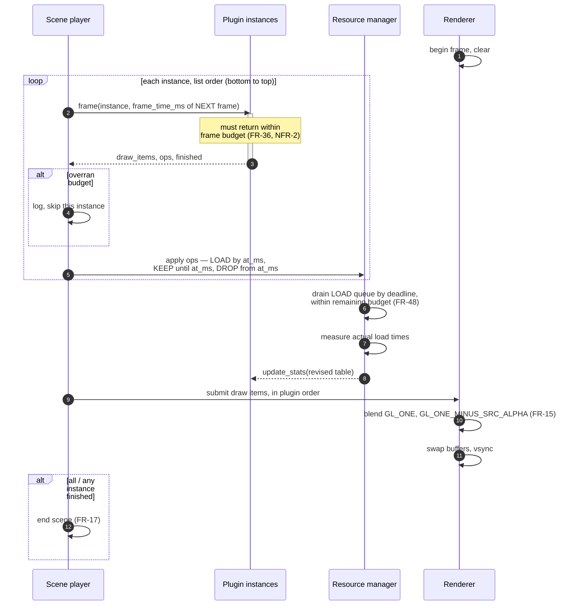

Rendered: [06-sequence-one-frame.svg](diagrams/06-sequence-one-frame.svg)

---

#### 7. Sequence — content update and activation `[P2]`

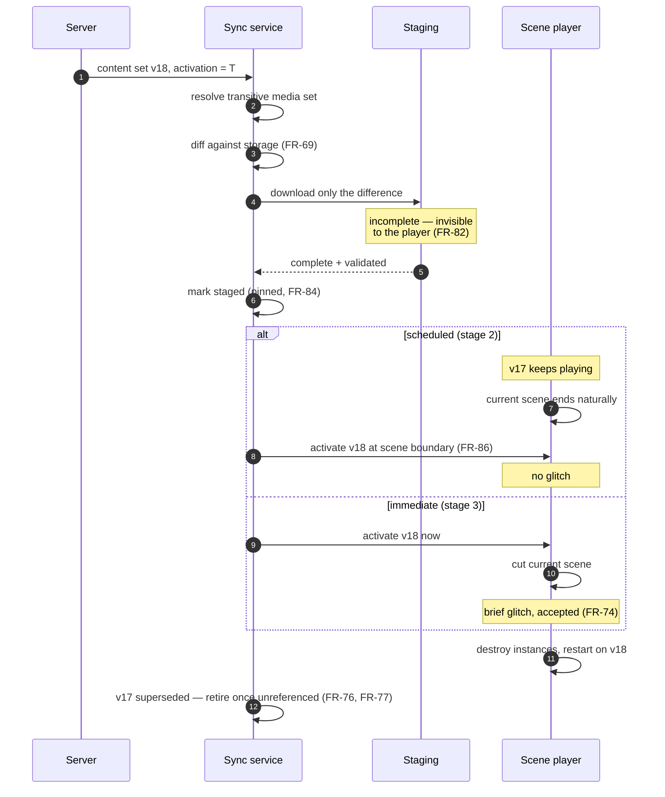

Rendered: [07-sequence-content-update-and-activation-p2.svg](diagrams/07-sequence-content-update-and-activation-p2.svg)

---

#### 8. State — content set `[P2]`

The pinning rules of FR-84. A set is collectable only from `Retired`.

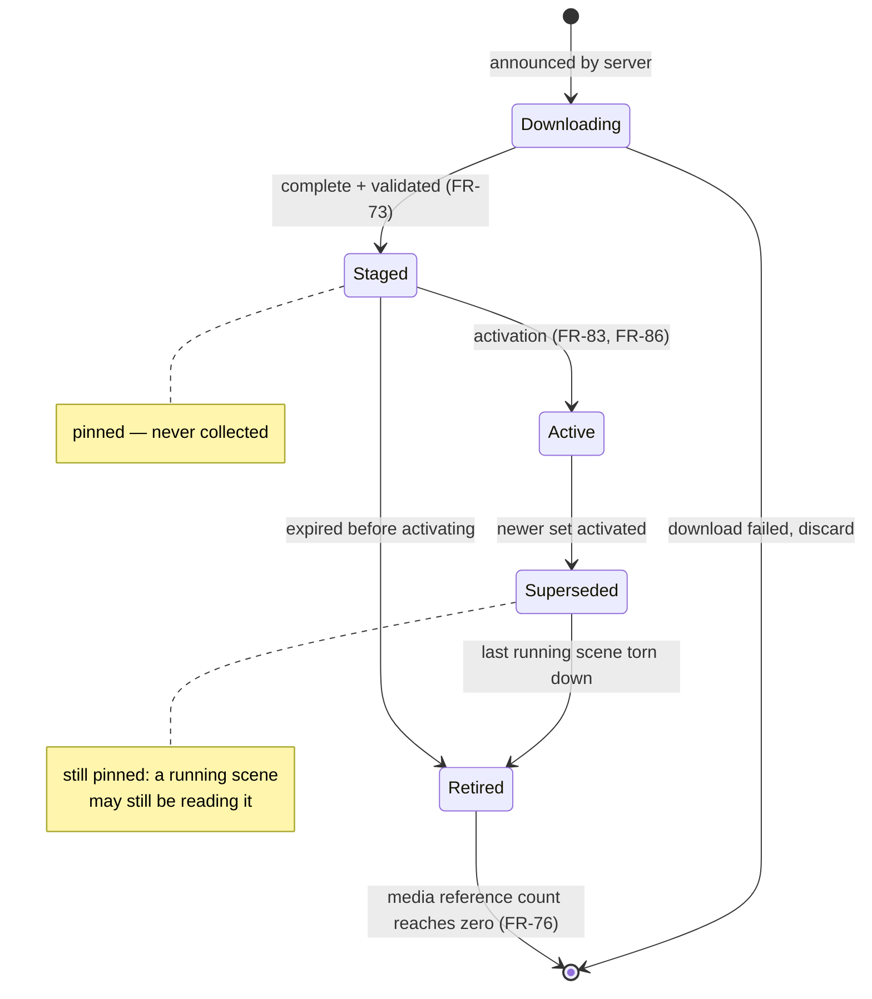

Rendered: [08-state-content-set-p2.svg](diagrams/08-state-content-set-p2.svg)

---

#### 9. State — scene

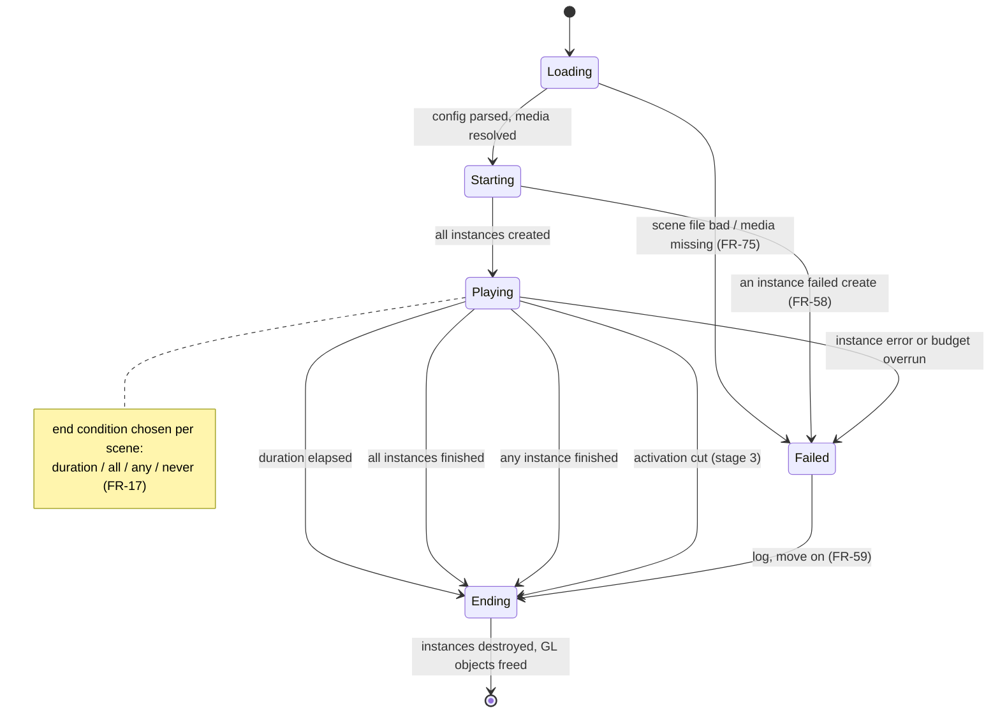

Rendered: [09-state-scene.svg](diagrams/09-state-scene.svg)

---

#### 10. State — plugin instance

Mirrors the three ABI entry points exactly; there are no other transitions.

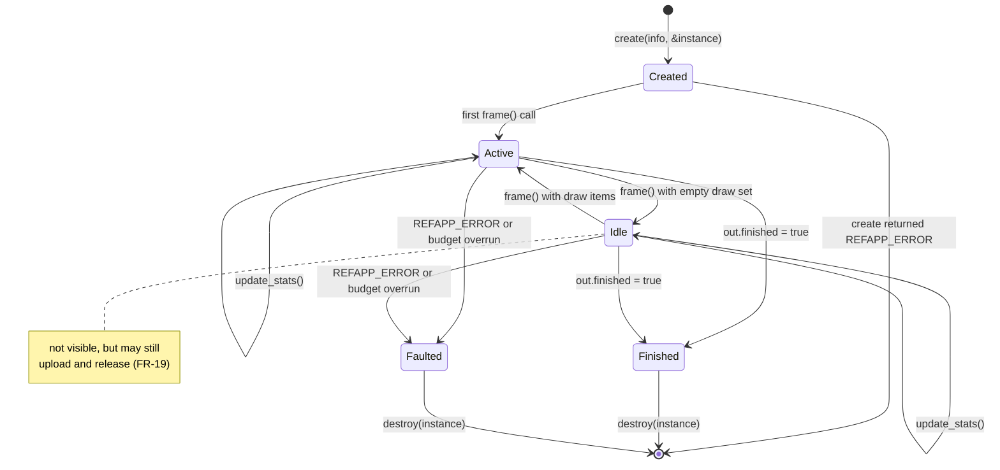

Rendered: [10-state-plugin-instance.svg](diagrams/10-state-plugin-instance.svg)

---

#### 11. State — resource residency

Per `(instance, kind, id)`, for textures and vertex buffers alike. The `at_ms`
deadline on a LOAD is what lets `Queued` exist at all — it is the window the
scheduler works in, and the plugin sizes it from the load statistics.

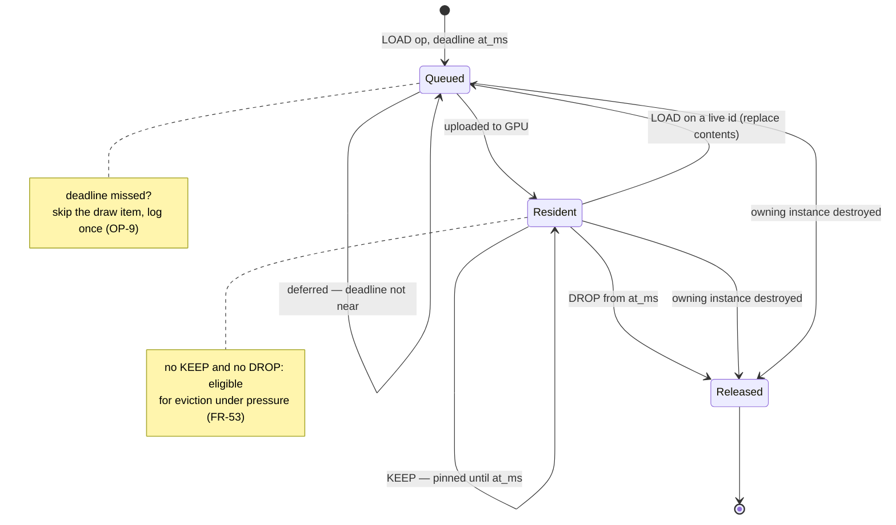

Rendered: [11-state-resource-residency.svg](diagrams/11-state-resource-residency.svg)
